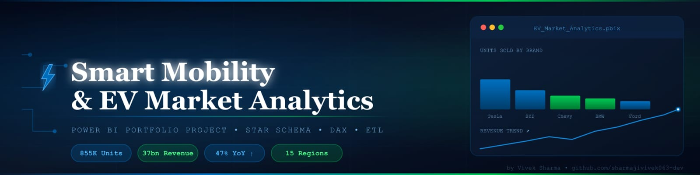
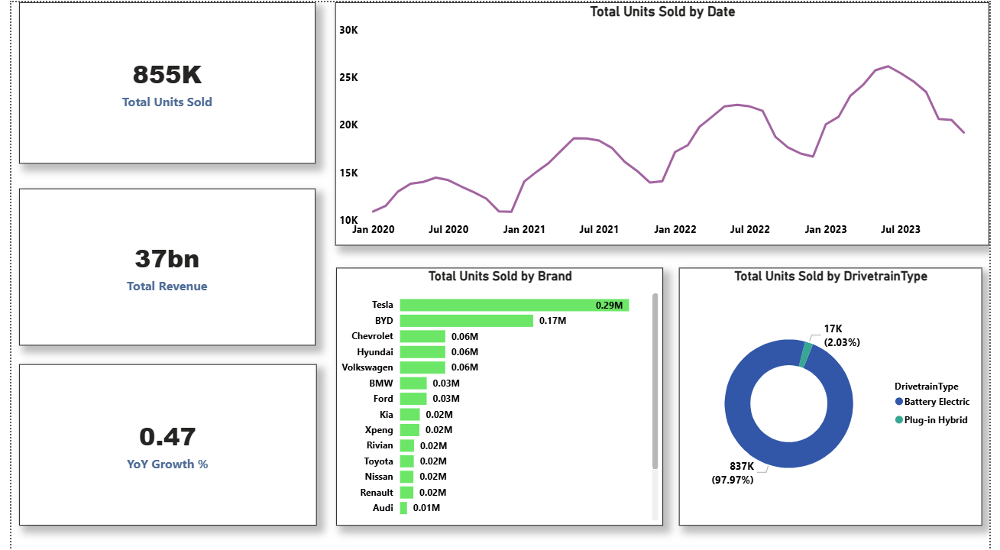
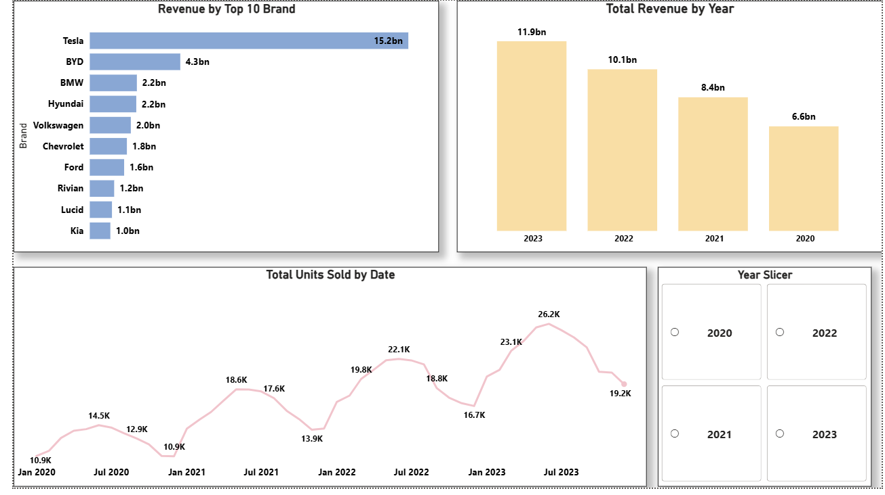
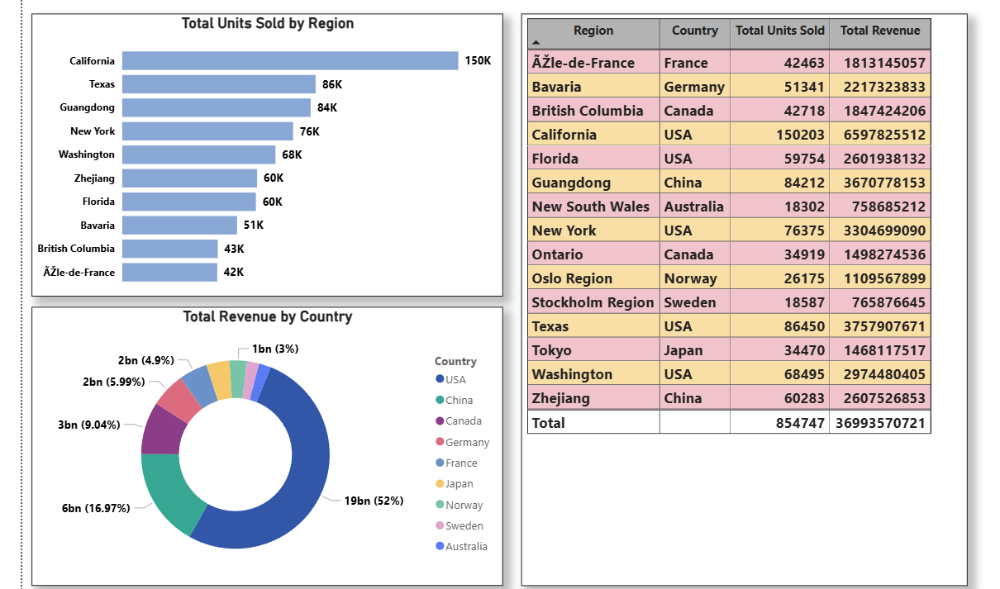

## 📊 Dashboard Preview

### Page 1 — Executive Summary

### Page 2 — Sales Trends

### Page 3 — Regional Analysis

# ⚡ Smart Mobility & EV Market Analytics

A professional Power BI dashboard tracking EV sales, charging station density and market penetration across 15 global regions and 30 vehicle models.

## 📊 Dashboard Results
- 855K Total Units Sold
- 37 Billion Total Revenue
- 47% YoY Growth
- Tesla & BYD leading brands
- 97.97% Battery Electric market share

## 🔧 Tools & Skills Used
- Power BI Desktop
- Power Query (ETL & Data Cleaning)
- DAX (YoY, Market Share, YTD measures)
- Star Schema Data Modelling
- Git & GitHub

## 📁 Project Files
| File | Description |
|------|-------------|
| Fact_EVSales.csv | 21,600 rows of sales data |
| Dim_Date.csv | Date dimension table |
| Dim_Region.csv | 15 global regions |
| Dim_Vehicle.csv | 30 EV models |
| DAX_Measures.txt | All DAX formulas |
| PowerQuery_MCode.txt | ETL transformations |

## 🗂️ Data Model
Star Schema with 1 Fact table and 3 Dimension tables

## 👤 Author
Vivek Sharma
